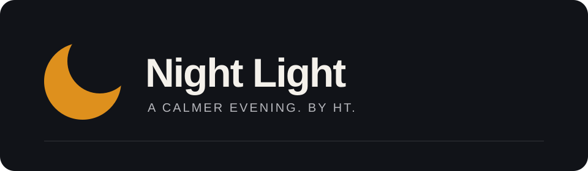
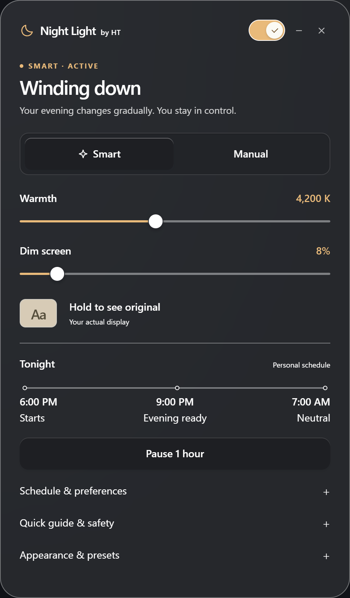
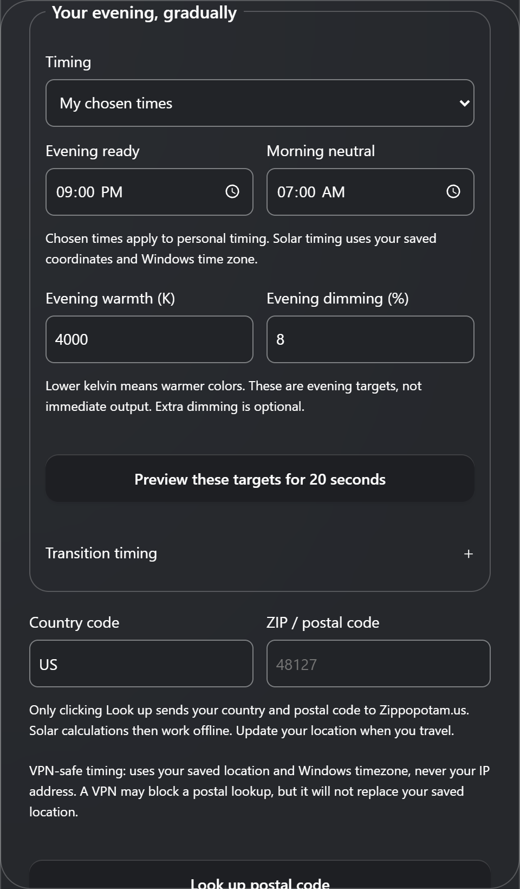
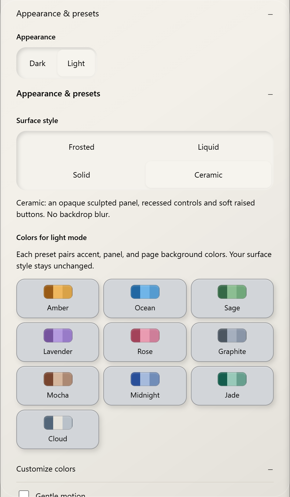

<p align="center"></p>

<p align="center">A free Windows companion for softer evening screens.<br />Gradual warmth. Optional dimming. Your pace.</p>

<p align="center">
<a href="https://hasstechapi.com/night-light/#download"><strong>Download for Windows</strong></a> &nbsp; · &nbsp;
<a href="https://hasstechapi.com/night-light/install/">Installation guide</a> &nbsp; · &nbsp;
<a href="https://hasstechapi.com/night-light/#app-preview">See the app</a>
</p>

> **Unsigned Early Access · 0.2.0 · Windows 11 x64**  
> Windows cannot verify the installer's publisher. SmartScreen may warn or block installation. Never disable Windows Security to install Night Light. The download page provides the current file, checksum, requirements, and limitations.

## A small app, thoughtfully arranged

<p align="center"></p>

*Captured from the actual application renderer with isolated example settings. Screenshots illustrate the interface, not a measurement or recording of physical display output.*

### Make evenings gradual

Smart Comfort supports your chosen evening and morning times, or sunset and sunrise with a saved location. Warmth and optional dimming have separate transition leads. Extra gradual pacing is available; a late start catches up within bounded adjustment rates. No mode promises invisible changes or better sleep.

### Keep control within reach

Use Manual for direct adjustments. Hold to compare original colors, pause Smart for an hour, or turn the filter off. Pin **Night Light** for a one-click toggle; open **Night Light Controls** for settings. They are two entry points into the same app.

### Make it yours

Choose light or dark appearance; Frosted, Liquid, Solid, or Ceramic surfaces; and individual presets for accent, panel, and background colors. Light and dark keep separate preferences. Liquid is a CSS treatment, not Apple's native Liquid Glass.

<table>
<tr><th>Smart Comfort</th><th>Appearance</th></tr>
<tr><td></td><td></td></tr>
</table>

## Get started in a few minutes

1. Visit the [official download page](https://hasstechapi.com/night-light/#download). Read the unsigned Early Access notice before downloading.
2. Run **Night Light Early Access Setup** if you accept that limitation and your device policy allows it. Choose **Install**, then follow the completion steps. Microsoft Edge WebView2 Runtime is required.
3. Open Start → **Night Light Controls**. Choose Manual, or open **Schedule & preferences** to configure Smart Comfort.
4. Choose your timing and evening targets. **Preview these targets for 20 seconds** is temporary. **Save and enable Smart** saves your schedule; wait for **Settings saved**, then check the display status separately.
5. In Start, right-click **Night Light** → **Pin to taskbar**. Click the pinned moon to toggle; use **Night Light Controls** whenever you want settings.

For Windows warnings, WebView2, an old pin, upgrades, or removal, follow the [complete illustrated installation guide](https://hasstechapi.com/night-light/install/). If Windows blocks installation, stop—do not disable protection.

## Local by design

- No account is required.
- Solar timing uses saved coordinates and the Windows timezone, **not your IP address or VPN location**. Update your saved location when you travel.
- A requested postal-code lookup contacts Zippopotam.us. After lookup, solar calculations work locally; a VPN can still block that lookup.
- The HT filter pauses when Windows Night Light is on or its state cannot be established, to avoid stacking adjustments.
- Smart Comfort does not need to observe screen contents or learn your bedtime from activity.

## Release and source status

The website is the current installer distribution channel. This is unsigned Early Access, not a certified or independently security-audited release. Hardware, HDR, color-managed applications, and Windows policy can affect behavior.

**Source synchronization is still in progress.** These product screenshots describe the current downloadable application. The repository's default-branch code is not yet a reproducible source snapshot of that installer; do not infer build parity from this README. A public source release must include version-bound build and verification instructions.

## Development

For the source checked out here, use Windows and Python 3.11–3.14:

```powershell
python -m venv .venv
.\.venv\Scripts\Activate.ps1
python -m pip install -e ".[dev]"
# Keep test output away from your real display and preferences.
$env:NIGHT_LIGHT_BY_HT_DISABLE_DISPLAY_BACKEND = "1"
$env:NIGHT_LIGHT_BY_HT_CONFIG_DIR = Join-Path $env:TEMP "night-light-dev-tests"
python -m pytest
```

See [architecture](docs/ARCHITECTURE.md), [privacy](docs/PRIVACY.md), and [research](docs/research/CIRCADIAN_LIGHTING.md). Do not commit personal configuration, logs, credentials, or generated executables.

## Honest limits

A warmer screen is not a biological light measurement. Room lighting, display brightness and spectrum, timing, viewing distance, and individual sensitivity all matter. Night Light does not diagnose or treat a condition, measure melatonin, or replace medical care. [Read the evidence and limits](https://hasstechapi.com/night-light/#research).

## Free by choice

Core controls stay free. Optional support funds development; it does not unlock essential features. [Support the project](https://hasstechapi.com/night-light/#support).

MIT © 2026 HassTech. See [LICENSE](LICENSE).
